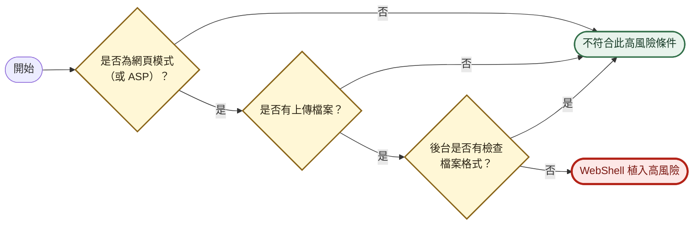

# WebShell 植入風險判斷流程

```mermaid
 flowchart LR
	Start([開始]) --> Q1{"是否為網頁模式<br/>（或 ASP）？"}
	Q1 -- 否 --> Normal([不符合此高風險條件])
	Q1 -- 是 --> Q2{"是否有上傳檔案？"}
	Q2 -- 否 --> Normal
	Q2 -- 是 --> Q3{"後台是否有檢查<br/>檔案格式？"}
	Q3 -- 是 --> Normal
	Q3 -- 否 --> Risk([WebShell 植入高風險])

	classDef decision fill:#fff7d6,stroke:#8a6418,color:#2b2415,stroke-width:2px;
	classDef normal fill:#e8f3ec,stroke:#33704a,color:#173b27,stroke-width:2px;
	classDef risk fill:#fde8e7,stroke:#b42318,color:#7a1812,stroke-width:3px;
	class Q1,Q2,Q3 decision;
	class Normal normal;
	class Risk risk;
```

當「網頁模式（或 ASP）」及「有上傳檔案」皆為「是」，且後台「未檢查檔案格式」時，判定為 WebShell 植入高風險。
