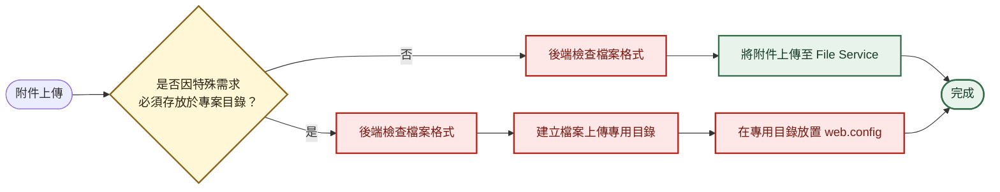

## 修補 WebShell 風險



專用目錄下的 `web.config` 內容：

```xml
<?xml version="1.0" encoding="UTF-8"?>
<configuration>
    <system.webServer>
        <handlers accessPolicy="Read" />
    </system.webServer>
</configuration>
```