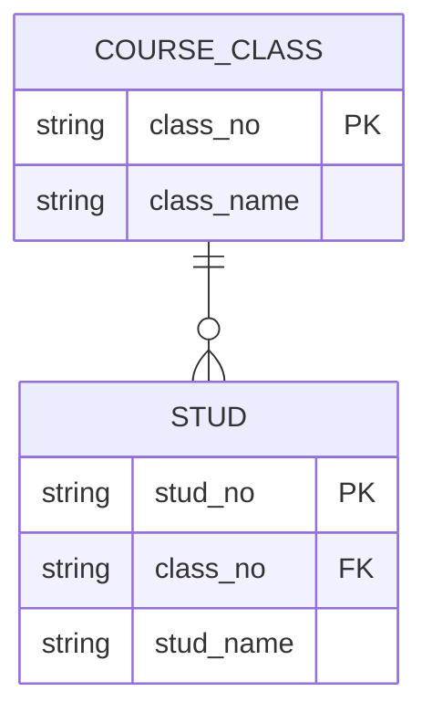

```mermaid
erDiagram
    COURSE_CLASS ||--o{ STUD : ""
    COURSE_CLASS {
        string class_no PK
        string class_name
    }
    STUD {
        string stud_no PK
        string class_no FK
        string stud_name
    }
```
