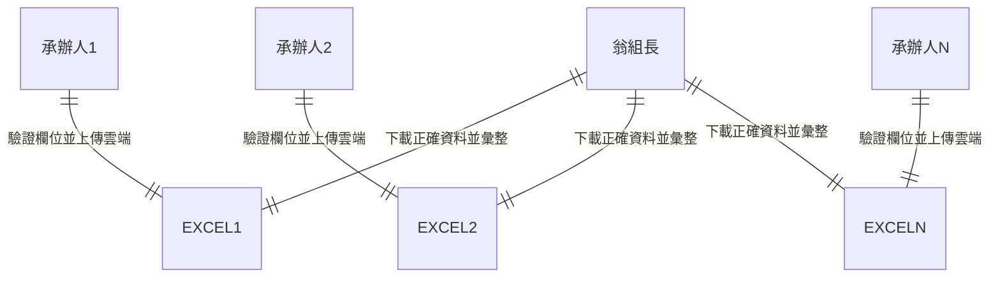

```mermaid
erDiagram    
    承辦人1 ||--|| EXCEL1 : "驗證欄位並上傳雲端"
    翁組長 ||--|| EXCEL1 : "下載正確資料並彙整"
    承辦人2 ||--|| EXCEL2 : "驗證欄位並上傳雲端"
    翁組長 ||--|| EXCEL2 : "下載正確資料並彙整"
    承辦人N ||--|| EXCELN : "驗證欄位並上傳雲端"        
    翁組長 ||--|| EXCELN : "下載正確資料並彙整"
```