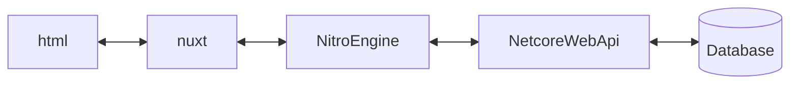
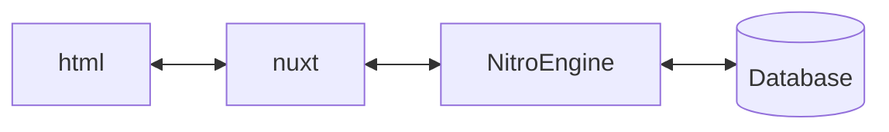

# net core webapi


# NitroEngine



```csharp
public void Add(int x, int y, Action<int> succ)
{
    succ(x + y);        
}

```

```csharp
string result = "";
Add(10, -1, (int sum) => { result = string.Format("x與y相加為:{0}", sum.ToString()); });
```

