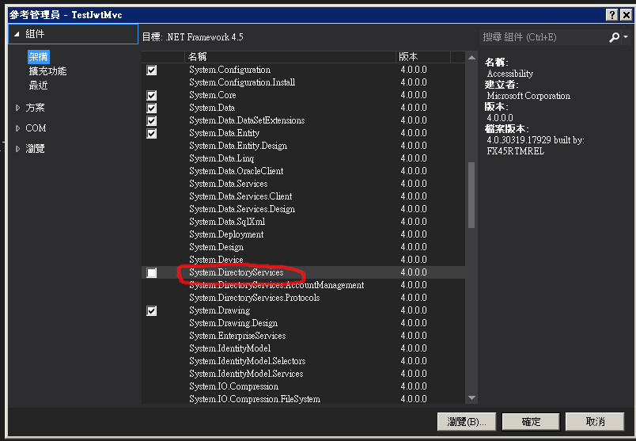

1. 加入參考System.DirectoryServices<br/>
    
2. ```csharp  
    using System.DirectoryServices;
    ...
    ...
    public enum Ou
    {
        faculty=0,
        student=1
    }

    public class LDAPService
    {
        public bool Verify(string user_id, string password,Enums.Ou ou)
        {
            bool rs = false;
            try
            {
                string user = string.Format("uid={0},ou={1},ou=People,dc=stut,dc=edu,dc=tw", user_id, ou.ToString());
                string path = "LDAP://xxxx.xxxx.xxx.xxx:xxx";
                DirectoryEntry myDr = new DirectoryEntry(path, user, password, AuthenticationTypes.None);
                try
                {
                    var cou = myDr.Children.SchemaFilter.Count;
                    rs = true;
                }
                catch
                {
                    rs = false;
                }

            }
            catch
            {
                rs = false;
            }
            return rs;
        }
    }
    
   ``` 